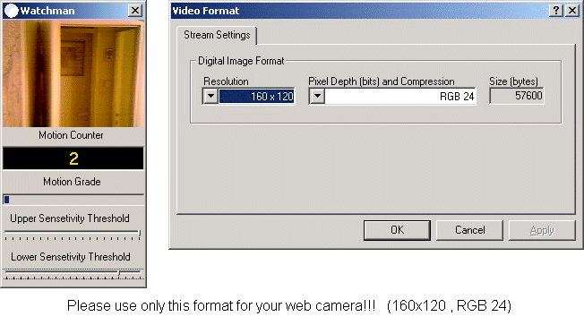



## \[   Watchman   \]

### Description

When web camera detects a motion this program shows what is the motion grade,counts all motions and barks like a dog!!!
 
### More Info
 

             |
---                |---
**Submitted On**   |2004-08-03 20:27:20
**By**             |[Michael Margold](https://github.com/Planet-Source-Code/PSCIndex/blob/master/ByAuthor/michael-margold.md)
**Level**          |Advanced
**User Rating**    |4.6 (96 globes from 21 users)
**Compatibility**  |VB 6\.0
**Category**       |[Complete Applications](https://github.com/Planet-Source-Code/PSCIndex/blob/master/ByCategory/complete-applications__1-27.md)
**World**          |[Visual Basic](https://github.com/Planet-Source-Code/PSCIndex/blob/master/ByWorld/visual-basic.md)
**Archive File**   |[Watchman177733832004\.zip](https://github.com/Planet-Source-Code/michael-margold-watchman__1-55330/archive/master.zip)

